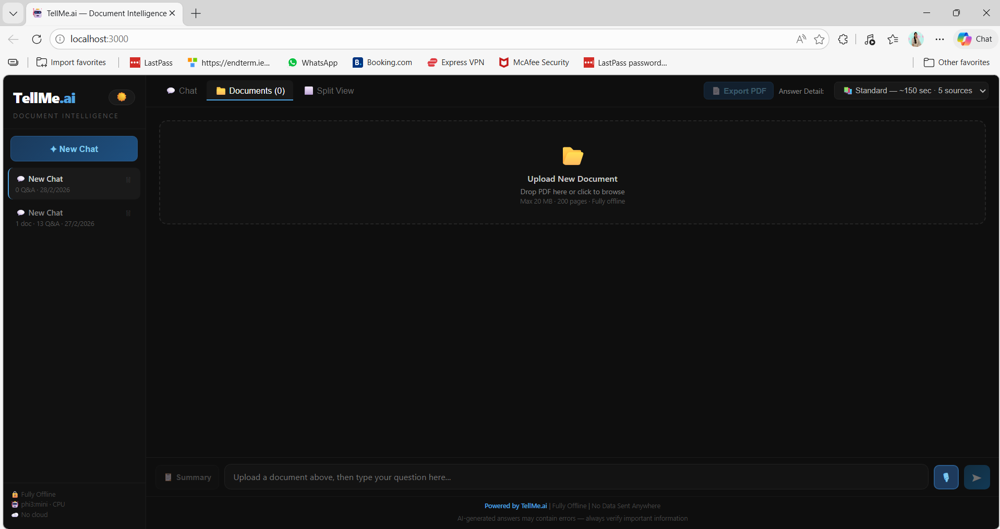
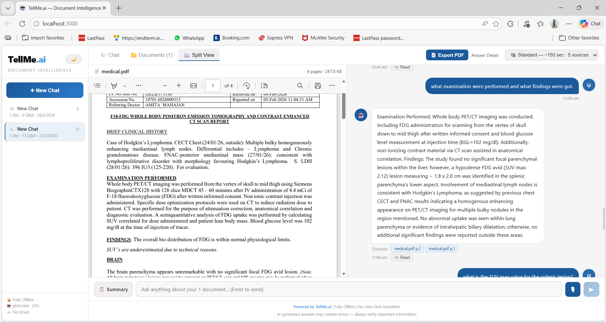
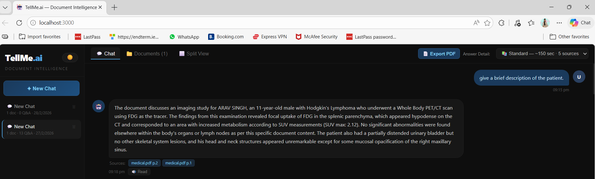
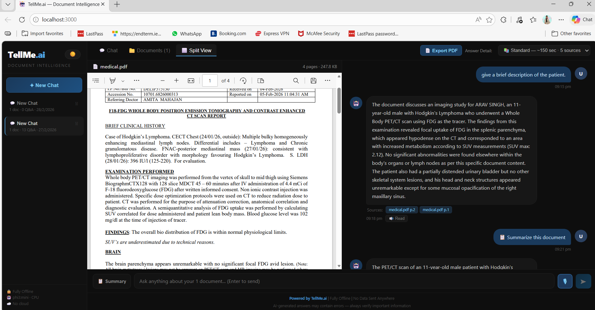

# 🤖 TellMe.ai — AI-Powered Multi-Document Reader & Voice Assistant

[](https://www.python.org/)
[](https://reactjs.org/)
[](LICENSE)
[]()

> **M.Sc. Computer Science Final Year Project — Ramniranjan Jhunjhunwala College, Mumbai (2025–2026)**

A fully offline, CPU-friendly RAG (Retrieval-Augmented Generation) system that reads PDF documents, answers questions using a local LLM, and supports voice interaction — no GPU, no cloud, no paid API.

## 📸 Screenshots

| Dark Theme | Light Theme |
|-----------|-------------|
|  |  |

| Answer with Citations | Split View — PDF + Chat |
|----------------------|------------------------|
|  |  |

---

## ✨ Key Features

- 📄 **Multi-Document Support** — Upload multiple PDFs per session, query across all of them
- 🧠 **RAG Pipeline** — FAISS vector search + phi3:mini for document-grounded answers
- 🚫 **Anti-Hallucination** — Strict 4-rule prompt: LLM answers ONLY from uploaded documents
- 🎙️ **Voice In + Voice Out** — Speak questions, hear answers via Web Speech API
- ⚡ **3 Speed Modes** — Quick (150 tokens), Standard (350), Deep (700)
- 📑 **Split View** — View PDF and chat side by side
- 💾 **Persistent Sessions** — Sessions saved to disk, resume after restart
- 📤 **Export to PDF** — Download full Q&A conversation as PDF
- 🌙 **Dark/Light Theme** — Toggle anytime

---

## 🏛️ Architecture — RAG Pipeline
```
PDF Upload → PyMuPDF text extraction → 500-word chunks (50-word overlap)
    → all-MiniLM-L6-v2 embeddings (384-dim) → FAISS IndexFlatL2

User Question → same embedding model → FAISS Top-K retrieval
    → Strict anti-hallucination prompt → phi3:mini via Ollama (offline)
    → SSE token streaming → React frontend → Source citations
```

---

## 🛠️ Tech Stack

| Layer | Technology | Purpose |
|-------|-----------|---------|
| **LLM** | phi3:mini (3.8B) via Ollama | Local offline inference |
| **Embeddings** | all-MiniLM-L6-v2 | 384-dim semantic vectors |
| **Vector Search** | FAISS IndexFlatL2 | CPU-based similarity search |
| **PDF Parsing** | PyMuPDF (fitz) | Page-by-page text extraction |
| **Backend** | FastAPI + Python | REST API + SSE streaming |
| **Frontend** | React 18.3 + Vite 5.4 | Single-page application |
| **Voice** | Web Speech API + pyttsx3 | Speech input and output |
| **Export** | jsPDF 4.2 | Chat-to-PDF export |

**Hardware:** Intel Core i3+ · 8GB RAM · No GPU required · Fully offline after setup

---

## 🚀 Installation & Setup

### Prerequisites
- Python 3.10+
- Node.js 16+
- [Ollama](https://ollama.ai) installed

### 1. Clone the Repository
```bash
git clone https://github.com/Harh2646/TellMe.ai.git
cd TellMe.ai
```

### 2. Backend Setup
```bash
python -m venv venv
venv\Scripts\activate
pip install -r requirements.txt
ollama pull phi3:mini
```

### 3. Download Embedding Model (one-time, ~90MB)
```python
from sentence_transformers import SentenceTransformer
model = SentenceTransformer("all-MiniLM-L6-v2")
model.save("./models/all-MiniLM-L6-v2")
```

### 4. Frontend Setup
```bash
cd frontend
npm install
```

---

## ▶️ Running the App

**Terminal 1 — Start Ollama:**
```bash
ollama run phi3:mini
```

**Terminal 2 — Start Backend:**
```bash
python backend/main.py
```

**Terminal 3 — Start Frontend:**
```bash
cd frontend
npm run dev
```

Open browser → `http://localhost:3000`

---

## 📁 Project Structure
```
TellMe.ai/
├── backend/
│   └── main.py
├── frontend/
│   ├── src/
│   │   ├── App.jsx
│   │   └── main.jsx
│   ├── index.html
│   ├── package.json
│   └── vite.config.js
├── docs/
│   └── screenshots/
├── requirements.txt
└── README.md
```

---

## 🔌 API Endpoints

| Method | Endpoint | Description |
|--------|----------|-------------|
| POST | `/sessions` | Create new session |
| GET | `/sessions` | List all sessions |
| DELETE | `/sessions/{id}` | Delete session |
| POST | `/sessions/{id}/upload` | Upload PDF |
| POST | `/sessions/{id}/query_stream` | Ask question (SSE streaming) |
| GET | `/sessions/{id}/summary` | Summarize document |
| GET | `/sessions/{id}/history` | Get chat history |

---

## 👨‍💻 Author

**Harsh Sanjay Singh**
M.Sc. Computer Science — Ramniranjan Jhunjhunwala College, Mumbai

- 📧 harshsingh2646@gmail.com
- 💼 [LinkedIn](https://www.linkedin.com/in/harsh-singh-a23334285)
- 🐙 [GitHub](https://github.com/Harh2646)

---

## 📄 License

MIT License — see [LICENSE](LICENSE) file for details.